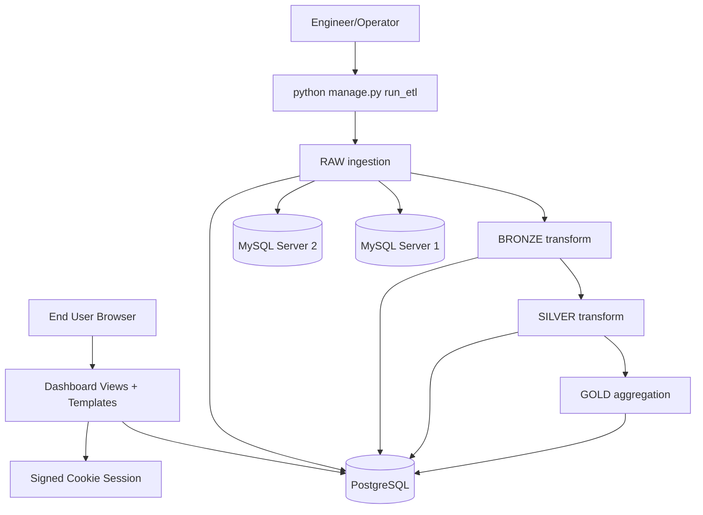
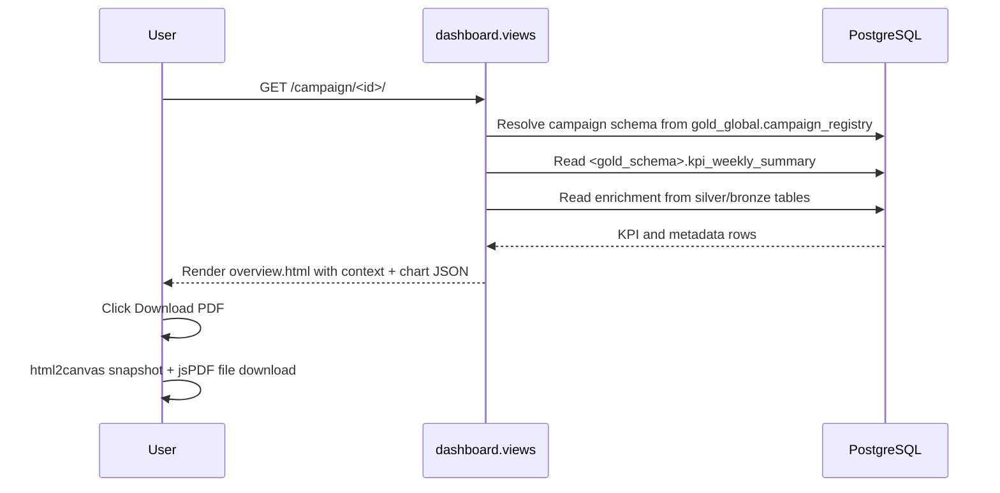
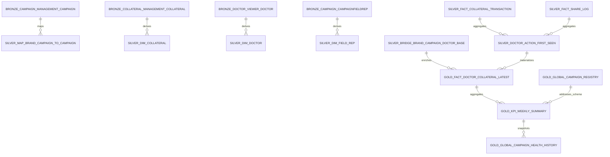

# EXPLANATION.md

This document is a complete repository-grounded system knowledge base for **ReportsVersion1**.

---

## 1) Product Overview

### What the system does
This project is a Django reporting application that ingests campaign-related data from two MySQL databases into PostgreSQL, transforms it through medallion layers (**RAW → BRONZE → SILVER → GOLD**), and serves a campaign dashboard UI with weekly and campaign health KPIs.

### Problem it solves
Operational data exists in multiple source systems and raw transactional structures. This project consolidates and standardizes those sources into analytical tables so users can:
- view campaign-level KPI summaries,
- inspect weekly engagement trends,
- compare current vs best vs benchmark collateral outcomes,
- and troubleshoot ETL/data availability from a debug page.

### Core features implemented in code
- End-to-end ETL orchestration via `python manage.py run_etl`.
- Source extraction from two MySQL servers with timeout/SSL configuration support.
- Layered transformations across PostgreSQL schemas:
  - `raw_server1`, `raw_server2`
  - `bronze`
  - `silver`
  - `gold_global` + per-campaign `gold_campaign_*`
  - `control` and `ops`
- Server-rendered dashboard pages:
  - campaign menu,
  - campaign login gate,
  - campaign overview,
  - ETL debug.
- Weekly filter and client-side PDF export.
- Signed-cookie session-based campaign access control.

### Target users / personas
- **Reporting/Analytics engineers**: run ETL, validate tables, inspect ETL run logs.
- **Backend developers**: extend SQL transforms and dashboard logic.
- **Business stakeholders**: review campaign performance and weekly health trends.
- **Ops/DevOps engineers**: configure env vars and deployment runtime behavior.

### Typical user journey
1. Engineer configures `.env` and runs `python manage.py run_etl`.
2. User opens `/` and chooses a campaign.
3. User logs in on `/campaign/<brand_campaign_id>/login/`.
4. User opens `/campaign/<brand_campaign_id>/` to view KPI dashboard.
5. User filters by week and optionally exports dashboard as PDF.
6. Engineer uses `/debug/etl/` to inspect schema/table readiness and latest ETL notes.

---

## 2) System Architecture

### Application layers
1. **Presentation layer**
   - Django templates (`dashboard/templates/dashboard/*.html`)
   - Static assets (`dashboard/static/dashboard/css/overview.css`, `dashboard/static/dashboard/js/overview.js`)
2. **Web/controller layer**
   - Django view functions in `dashboard/views.py`
3. **ETL/business transformation layer**
   - Pipeline modules in `etl/pipelines/*`
   - Orchestration command in `etl/management/commands/run_etl.py`
4. **Data access layer**
   - PostgreSQL helper (`etl/connectors/postgres.py`)
   - MySQL source connectors (`etl/connectors/mysql_server1.py`, `etl/connectors/mysql_server2.py`)
5. **Storage layer**
   - PostgreSQL analytical/control schemas
   - External MySQL source databases

### Backend / frontend separation
- **Backend**: Django renders HTML with server-side computed context (KPIs, weekly series, states, metadata).
- **Frontend**: lightweight JavaScript renders grouped bar chart on `<canvas>`, handles week select auto-submit, and exports PDF via third-party browser libs.

### Infrastructure/runtime components
- Django app entrypoints: `manage.py`, `config/wsgi.py`, `config/asgi.py`.
- Environment loader in `config/settings/base.py` with `.env` path precedence.
- Optional local PostgreSQL container bootstrap in `setup_local.sh`.

### Architecture diagram


### Component interaction diagram


---

## 3) Repository Structure

### Tree-style overview
```text
.
├── .env
├── .gitignore
├── EXPLANATION.md
├── README.md
├── requirements.txt
├── setup_local.sh
├── manage.py
├── config/
│   ├── __init__.py
│   ├── asgi.py
│   ├── urls.py
│   ├── wsgi.py
│   └── settings/
│       ├── __init__.py
│       ├── base.py
│       ├── dev.py
│       └── prod.py
├── dashboard/
│   ├── __init__.py
│   ├── apps.py
│   ├── views.py
│   ├── templates/dashboard/
│   │   ├── menu.html
│   │   ├── login.html
│   │   ├── overview.html
│   │   └── debug.html
│   └── static/dashboard/
│       ├── css/overview.css
│       └── js/overview.js
├── etl/
│   ├── __init__.py
│   ├── apps.py
│   ├── connectors/
│   │   ├── __init__.py
│   │   ├── postgres.py
│   │   ├── mysql_server1.py
│   │   └── mysql_server2.py
│   ├── control/
│   │   ├── __init__.py
│   │   └── repository.py
│   ├── dq/__init__.py
│   ├── management/
│   │   ├── __init__.py
│   │   └── commands/
│   │       ├── __init__.py
│   │       └── run_etl.py
│   ├── pipelines/
│   │   ├── __init__.py
│   │   ├── raw_ingestion.py
│   │   ├── bronze_transform.py
│   │   ├── silver_transform.py
│   │   └── gold_aggregations.py
│   └── utils/
│       ├── __init__.py
│       ├── normalization.py
│       └── specs.py
├── docs/
│   └── TECHNICAL_DOCUMENTATION.md
├── reporting/__init__.py
├── ops_admin/__init__.py
└── sample artifacts (*.csv, *.pdf)
```

### Purpose of major directories/files
- `config/`: project settings, URL routes, WSGI/ASGI app loading.
- `dashboard/`: presentation layer (views, templates, styling, chart/export script).
- `etl/`: ingestion, transformations, schema/materialization logic, run logging.
- `docs/`: existing long-form docs in repository.
- `setup_local.sh`: local environment bootstrap script.
- `requirements.txt`: Python dependencies.
- `.env`: local environment variable template/instance.

### Notes on absent structures
- Django ORM models for business tables are **not explicitly defined in the repository**.
- Django migrations for ETL analytical tables are **not explicitly defined in the repository**.
- SQL schema files for all tables are **not explicitly defined as standalone files**; schema is generated in pipeline code.

---

## 4) Core System Components

### 4.1 Django configuration and startup

#### `manage.py`
- Sets default settings module to `config.settings.dev`.
- Delegates command handling to Django CLI.

#### `config/settings/base.py`
- Loads env vars from first existing path:
  1. `DJANGO_ENV_FILE`
  2. `/var/www/secrets/.env`
  3. `<repo>/.env`
- Defines Django installed apps (`etl`, `dashboard` + Django defaults).
- Configures PostgreSQL `DATABASES` with alias fallbacks (`POSTGRES_*`, `DB_*`, `PG*`).
- Defines MySQL source connection dicts for server1/server2 (host/port/user/password/database/timeouts/SSL).
- Uses signed-cookie sessions: `SESSION_ENGINE = django.contrib.sessions.backends.signed_cookies`.

#### `config/settings/dev.py`, `prod.py`
- Thin overlays setting `DEBUG=True` or `DEBUG=False`.

#### `config/urls.py`
Routes:
- `/` → campaign menu
- `/debug/etl/` → ETL debug page
- `/campaign/<id>/login/` → campaign login
- `/campaign/<id>/` → campaign overview
- `/campaign/<id>/export/` → export route
- `/admin/` → Django admin

### 4.2 Dashboard views (`dashboard/views.py`)

Major responsibilities:
- DB query helpers (`_fetch_dicts`).
- Utility conversions (`_to_float`, `_to_int`, `_safe_pct`, `_health_color`, etc.).
- Campaign menu source assembly with record filtering (`_campaign_list`).
- ETL diagnostics snapshot (`_build_debug_snapshot`).
- Campaign auth flow via deterministic credentials (`_campaign_credentials`, `campaign_login`).
- Report context assembly (`_build_report_context`):
  - resolves target GOLD schema,
  - loads weekly KPI rows,
  - computes KPI percentages and health labels,
  - computes state attention list,
  - resolves brand/collateral/schedule metadata,
  - resolves company logo URL with fixed media prefix,
  - builds trend series for frontend chart.

### 4.3 Dashboard templates and frontend

#### Templates
- `menu.html`: campaign list table and report entry links.
- `login.html`: form-based campaign login (username/password).
- `overview.html`: all KPI cards, trend chart canvas, weekly table, state panel, comparison cards.
- `debug.html`: layer-by-layer schema/table diagnostics and latest ETL note summary.

#### Static JS (`overview.js`)
- Reads chart series JSON emitted via Django `json_script` tags.
- Draws grouped bars for 4 series:
  - Doctors Opened %
  - Doctors Reached %
  - PDF Downloads %
  - Video Viewed (>50%) %
- Auto-submits week filter on selection change.
- Captures dashboard DOM and writes PDF via `html2canvas` + `jsPDF`.

#### Static CSS (`overview.css`)
- Provides dashboard cards, responsive grids, trend legend colors, menu/login/debug styling.
- Includes explicit colors for health and legend classes.

### 4.4 ETL connectors

#### PostgreSQL (`etl/connectors/postgres.py`)
- `cursor()` context manager.
- `execute(sql, params)` for statements.
- `fetchall(sql, params)` returning list of dict rows.

#### MySQL connectors (`mysql_server1.py`, `mysql_server2.py`)
- Build PyMySQL connection params from Django settings.
- Support SSL modes (`required`, `verify_ca`, `verify_identity`) and optional CA cert path.
- Extract full table via `SELECT * FROM <table>`.
- Raise `MySQLExtractionError` with contextual hints for connectivity/auth/SSL/dependency issues.

### 4.5 ETL control repository (`etl/control/repository.py`)
- Ensures control schema and tables:
  - `etl_run_log`
  - `etl_step_log`
  - `etl_watermark`
  - `dq_issue_log`
- Logs run status with upsert behavior in `log_run`.

### 4.6 ETL orchestration command (`etl/management/commands/run_etl.py`)
- Generates run id (`YYYYMMDDHHMMSS`) unless provided by `--run-id`.
- Executes full pipeline sequence.
- Produces status: `SUCCESS`, `PARTIAL_SUCCESS`, or `FAIL` based on source extraction failures.
- Stores JSON run summary (`counts`, `errors`, totals) in `control.etl_run_log.notes`.

### 4.7 Pipeline modules

#### RAW (`etl/pipelines/raw_ingestion.py`)
- Creates `raw_server1`/`raw_server2` schemas and source tables based on canonical specs.
- Creates all source columns as `TEXT` + audit columns.
- Loads rows from MySQL, enriches with ingestion metadata and hash identity.
- Returns counts/errors by table.

#### BRONZE (`etl/pipelines/bronze_transform.py`)
- Creates `bronze` schema/tables mirroring raw + additional bronze metadata columns.
- Deduplicates using window function by `COALESCE(id, _record_hash)` and timestamp precedence.
- Creates `ops.exclusion_rules` table.
- Deletes transaction rows with test/blank brand campaign ids.

#### SILVER (`etl/pipelines/silver_transform.py`)
- Rebuilds conformed tables using `DROP TABLE IF EXISTS` + `CREATE TABLE AS SELECT`.
- Produces dimensions, facts, campaign mapping, doctor base bridge, and first-seen action table.
- Normalizes bool/date/identity-related attributes via SQL expressions.

#### GOLD (`etl/pipelines/gold_aggregations.py`)
- Creates/maintains global tables:
  - campaign registry,
  - campaign health history,
  - benchmark table (last 10 campaign health records for current date).
- For each valid campaign mapping:
  - creates campaign schema name from normalized campaign id,
  - materializes latest doctor-collateral fact,
  - materializes weekly KPI summary,
  - scaffolds `weekly_action_items` table,
  - writes campaign daily health snapshot.

---

## 5) Data Model / Database Design (Reconstructed from Code)

> Source of truth: pipeline SQL and source table specs in repository code.

### 5.1 Source table specs (RAW/BRONZE base)

#### mysql_server_1 tables
1. `campaign_fieldrep`
   - `id, full_name, phone_number, brand_supplied_field_rep_id, is_active, password_hash, created_at, updated_at, brand_id, user_id, state`
2. `campaign_campaign`
   - `updated_at, system_rfa, system_pe, system_ic, status, start_date, register_message, num_doctors_supported, name, id, end_date, doctor_recruitment_link, created_at, contact_person_phone, contact_person_name, contact_person_email, brand_manager_password_encrypted, brand_manager_login_token, brand_manager_login_link, brand_manager_email, brand_id, banner_target_url, banner_small_url, banner_small_key, banner_large_url, banner_large_key, add_to_campaign_message`

#### mysql_server_2 tables
1. `campaign_management_campaign`
   - `id, name, brand_name, start_date, end_date, description, status, created_at, updated_at, created_by_id, brand_campaign_id, brand_logo, company_logo, company_name, contract, incharge_contact, incharge_designation, incharge_name, items_per_clinic_per_year, num_doctors, printing_excel, printing_required`
2. `collateral_management_campaigncollateral`
   - `id, start_date, end_date, created_at, updated_at, campaign_id, collateral_id`
3. `collateral_management_collateral`
   - `id, type, title, file, vimeo_url, content_id, upload_date, is_active, created_at, updated_at, banner_1, banner_2, campaign_id, created_by_id, description, purpose, doctor_name, webinar_date, webinar_description, webinar_title, webinar_url`
4. `sharing_management_sharelog`
   - `id, share_channel, share_timestamp, message_text, created_at, updated_at, short_link_id, collateral_id, doctor_identifier, brand_campaign_id, field_rep_email, field_rep_id`
5. `sharing_management_collateraltransaction`
   - `id, transaction_id, brand_campaign_id, field_rep_id, field_rep_unique_id, doctor_name, doctor_number, doctor_unique_id, collateral_id, transaction_date, has_viewed, downloaded_pdf, pdf_completed, video_view_lt_50, video_view_gt_50, video_completed, pdf_total_pages, last_video_percentage, pdf_last_page, doctor_viewer_engagement_id, share_management_engagement_id, video_tracking_last_event_id, created_at, updated_at, sent_at, viewed_at, first_viewed_at, viewed_last_page_at, video_lt_50_at, video_gt_50_at, video_100_at, last_viewed_at, dv_engagement_id, field_rep_email, share_channel, sm_engagement_id, video_watch_percentage`
6. `doctor_viewer_doctor`
   - `id, name, phone, rep_id, source`

#### Audit columns injected in RAW
`_ingestion_run_id, _ingested_at, _source_server, _source_table, _extract_started_at, _extract_ended_at, _record_hash, _is_deleted, _dq_status, _dq_errors`

### 5.2 Schema inventory and table purposes

| Schema | Table | Purpose |
|---|---|---|
| `raw_server1` | source tables from mysql_server_1 | Raw ingested rows + audit metadata |
| `raw_server2` | source tables from mysql_server_2 | Raw ingested rows + audit metadata |
| `bronze` | all source table names | Deduplicated raw copy for downstream transforms |
| `silver` | `dim_field_rep` | field rep conformed dimension |
| `silver` | `dim_doctor` | doctor conformed dimension and identity key |
| `silver` | `dim_collateral` | collateral conformed dimension |
| `silver` | `bridge_campaign_collateral_schedule` | campaign-collateral schedule mapping |
| `silver` | `fact_collateral_transaction` | normalized transactional engagement fact |
| `silver` | `fact_share_log` | normalized share-log fact |
| `silver` | `map_brand_campaign_to_campaign` | brand campaign id → campaign id mapping |
| `silver` | `bridge_brand_campaign_doctor_base` | per-campaign doctor base |
| `silver` | `doctor_action_first_seen` | first seen reached/opened/video/pdf dates by doctor+campaign+collateral |
| `gold_global` | `campaign_registry` | map campaign id to generated gold schema |
| `gold_global` | `campaign_health_history` | campaign health snapshots by date |
| `gold_global` | `benchmark_last_10_campaigns` | aggregate benchmark over latest 10 records |
| `gold_campaign_*` | `fact_doctor_collateral_latest` | campaign-level latest engagement grain |
| `gold_campaign_*` | `kpi_weekly_summary` | weekly KPI/health aggregates |
| `gold_campaign_*` | `weekly_action_items` | empty scaffold table for future action recommendations |
| `control` | `etl_run_log` | ETL run summaries |
| `control` | `etl_step_log` | step-level logs (created, not actively populated in current command) |
| `control` | `etl_watermark` | watermark metadata (created) |
| `control` | `dq_issue_log` | data quality issue log table (created) |
| `ops` | `exclusion_rules` | operational exclusion rules table |

### 5.3 Key analytical formulas visible in SQL

In `<gold_schema>.kpi_weekly_summary`:
- `doctors_consumed_unique` uses unique doctor OR logic:
  - `(video_gt_50_first_date in week) OR (pdf_download_first_date in week)`
- `weekly_reached_pct` uses campaign weekly doctor base and is capped with `LEAST(..., 1.0)`.
- `weekly_opened_pct = doctors_opened_unique / doctors_reached_unique` when denominator > 0.
- `weekly_consumption_pct = doctors_consumed_unique / doctors_opened_unique` when denominator > 0.
- `weekly_health_score = avg(weekly_reached_pct, weekly_opened_pct, weekly_consumption_pct) * 100`.
- Color buckets:
  - `<40` Red,
  - `<60` Yellow,
  - else Green.

### 5.4 ER diagram (logical/inferred)


### 5.5 Constraints, indexes, relationships
- Primary keys are explicitly created only in selected control/global tables (`control.etl_run_log`, `control.etl_watermark`, `gold_global.campaign_registry`, `gold_global.campaign_health_history`).
- Foreign keys are **Not explicitly defined in the repository.**
- Secondary indexes are **Not explicitly defined in the repository.**

---

## 6) Feature-Level Documentation

### Feature A: Campaign menu listing
- **Purpose:** show only valid campaign entries that can be opened.
- **User flow:** user opens `/` and sees a table of campaign ids and names.
- **Backend logic:** `_campaign_list()` joins registry + mapping + bronze campaign tables and filters null/test/dummy campaign names.
- **DB interactions:**
  - `gold_global.campaign_registry`
  - `silver.map_brand_campaign_to_campaign`
  - `bronze.campaign_campaign`
  - `bronze.campaign_management_campaign`
- **Components:** `dashboard/views.py`, `menu.html`.

### Feature B: Campaign login/auth
- **Purpose:** gate report pages per campaign.
- **User flow:** user enters username/password on login page.
- **Backend logic:** compares posted credentials against deterministic generator from campaign id.
- **Auth storage:** session key `auth_<campaign_id>` in signed cookies.
- **Components:** `campaign_login` view + `login.html`.
- **Note:** Full user management/role model is **Not explicitly defined in the repository.**

### Feature C: Overview dashboard
- **Purpose:** KPI and trend visualization for one campaign.
- **User flow:** open campaign page, optionally choose week.
- **Backend logic:** `_build_report_context` loads weekly rows, computes KPI percentages/colors/wow deltas, state attention rows, collateral comparison cards, and brand metadata.
- **State attribution detail:** state fallback in dashboard queries now resolves from campaign fact state first, then campaign-doctor base, then doctor dimension, then field-rep mapping (`source_field_rep_id` with `id` fallback), and finally raw `bronze.campaign_fieldrep.state` mapped by brand-supplied field-rep id; this aligns state joins with current `campaign_fieldrep` data shape. SILVER joins also normalize case/whitespace when matching rep ids to improve state propagation from `campaign_fieldrep`.
- **DB interactions:** campaign-specific GOLD tables and related SILVER/BRONZE metadata joins.
- **Frontend:** `overview.html`, `overview.css`, `overview.js` chart rendering.

### Feature D: Company logo rendering
- **Purpose:** show campaign-specific company logo image.
- **Backend logic:** reads `company_logo` from campaign record resolution query and builds URL with fixed prefix `https://inclinic.inditech.co.in/media/`.
- **Fallback:** if missing/invalid path, renders text block logo.
- **Components:** `_build_media_logo_url`, overview header markup.

### Feature E: ETL debug snapshot
- **Purpose:** operational observability of data readiness.
- **User flow:** open `/debug/etl/`.
- **Backend logic:** checks expected schemas/tables, counts rows, loads latest run notes and errors.
- **Components:** `_build_debug_snapshot`, `debug.html`.

### Feature F: PDF export
- **Purpose:** download report snapshot.
- **Flow:** browser captures `#report-root` and writes PDF file.
- **Libraries used:** CDN `html2canvas` and `jspdf` loaded in template.
- **Component:** `overview.js`.

### Feature G: ETL processing
- **Purpose:** continuously reconstruct analytical layers from source systems.
- **Flow:** run command executes all pipeline stages and logs status.
- **Failure behavior:** source extraction failures can lead to PARTIAL_SUCCESS; notes include per-table errors.

---

## 7) API / Service Layer

This project is page-rendered rather than JSON API-driven.

### 7.1 HTTP endpoints

| Endpoint | Method | Purpose | Request Parameters | Request Body | Response | Auth | Database |
|---|---|---|---|---|---|---|---|
| `/` | GET | Campaign menu | None | None | HTML (`menu.html`) | No | `gold_global`, `silver`, `bronze` |
| `/debug/etl/` | GET | ETL status and schema diagnostics | None | None | HTML (`debug.html`) | No | `information_schema`, `control`, layer tables |
| `/campaign/<brand_campaign_id>/login/` | GET, POST | Campaign credential check | Path `brand_campaign_id` | form: `username`, `password` | HTML or redirect | No (sets session on success) | campaign lookup query |
| `/campaign/<brand_campaign_id>/` | GET | Campaign overview page | Path + optional query `week` | None | HTML (`overview.html`) | Yes (`auth_<campaign_id>` session key) | `gold_global`, `gold_campaign_*`, `silver`, `bronze` |
| `/campaign/<brand_campaign_id>/export/` | GET | Export variant of overview context | Path + optional query `week` | None | HTML (`overview.html`) | Yes (`auth_<campaign_id>`) | same as overview |
| `/admin/` | GET/POST | Django admin | standard | standard | Django admin pages | Django auth | Not custom-coded in repo |

### 7.2 Service/command handlers

| Interface | Type | Purpose | Input | Output |
|---|---|---|---|---|
| `python manage.py run_etl [--run-id]` | Django mgmt command | Execute full ETL | optional run id | DB side effects + console output + control log entry |
| `ingest_raw(run_id)` | Python function | Extract+load raw rows | run id | counts/errors dict |
| `build_bronze()` | Python function | Dedupe/filter bronze tables | none | DB side effects |
| `build_silver(run_id)` | Python function | Build conformed dimensions/facts | run id | DB side effects |
| `build_gold(run_id)` | Python function | Build campaign/global marts | run id | DB side effects |

---

## 8) End-to-End Application Flows

### Flow 1: ETL processing
```text
User/Operator action: run `python manage.py run_etl`
↓
run_etl command ensures control tables
↓
RAW ingestion creates schemas/tables and loads source rows
↓
BRONZE transform deduplicates and applies exclusions
↓
SILVER transform rebuilds conformed facts/dimensions/bridges
↓
GOLD transform builds campaign schemas and weekly/global KPIs
↓
run status + summary notes are logged in control.etl_run_log
```

### Flow 2: Campaign authentication and report access
```text
User opens campaign login URL
↓
Server resolves campaign in menu list
↓
User submits deterministic credentials
↓
Server validates credentials and sets signed-cookie session key
↓
User is redirected to campaign overview route
↓
Overview context is built from GOLD+SILVER+BRONZE data
↓
HTML rendered with chart/legend/table sections
```

### Flow 3: Week filter interaction
```text
User changes week dropdown in overview page
↓
JS auto-submits GET request with ?week=<n>
↓
Server validates requested week against available non-empty weeks
↓
Context narrows to week rows
↓
Updated KPI cards/table/trend are rendered
```

### Flow 4: ETL diagnostics
```text
User opens /debug/etl/
↓
Server checks schema and table existence/counts
↓
Server fetches latest run metadata + parsed error notes
↓
Debug page renders layer snapshots and campaign schema table checks
```

### Flow 5: PDF export
```text
User clicks Download PDF
↓
overview.js captures dashboard DOM using html2canvas
↓
jsPDF paginates image to A4 pages
↓
Browser downloads in_clinic_report_<campaign>_<week>.pdf
```

---

## 9) Developer Onboarding Guide

### 9.1 Environment setup
Required tools/frameworks shown by repo:
- Python 3
- Django
- PostgreSQL
- MySQL source access
- pip
- Optional Docker (used by bootstrap script)

Dependencies (`requirements.txt`):
- Django>=5.0,<6.0
- psycopg2-binary>=2.9
- PyMySQL>=1.1
- cryptography>=42.0

### 9.2 Installation
```bash
python -m venv .venv
source .venv/bin/activate
pip install -r requirements.txt
```

Configure `.env` (or `DJANGO_ENV_FILE`) values:
- Django: `DJANGO_SETTINGS_MODULE`, `DJANGO_DEBUG`, `DJANGO_SECRET_KEY`
- PostgreSQL: `POSTGRES_DB`, `POSTGRES_USER`, `POSTGRES_PASSWORD`, `POSTGRES_HOST`, `POSTGRES_PORT`
- MySQL source 1: `MYSQL_SERVER1_*`
- MySQL source 2: `MYSQL_SERVER2_*`

### 9.3 Database initialization
No migration-based schema for ETL marts exists; running ETL creates tables/schemas.

```bash
python manage.py run_etl
```

### 9.4 Running application
```bash
python manage.py check
python manage.py run_etl
python manage.py runserver
```

### 9.5 One-command local bootstrap
```bash
./setup_local.sh
```
What script does:
1. verify `.env` exists,
2. create `.venv`,
3. install dependencies,
4. optionally start/create Docker container `reports-postgres`,
5. run Django checks,
6. run ETL.

### 9.6 Production notes available in repo
- Use `config.settings.prod` (DEBUG=False).
- Settings can load env from `/var/www/secrets/.env` when present.

### 9.7 Testing and CI
- Automated unit/integration test suite is **Not explicitly defined in the repository.**
- Validation in repository scripts/docs is command-driven (`manage.py check`, ETL run).

---

## 10) AI-Optimized System Summary

- **Type:** Django server-rendered reporting app with SQL-centric ETL.
- **Primary packages:**
  - `dashboard`: views/templates/static report UI,
  - `etl`: connectors + medallion transforms + orchestration.
- **Data flow:** MySQL full-table extraction → PostgreSQL RAW/BRONZE/SILVER/GOLD materialization.
- **Key marts:**
  - `gold_global.campaign_registry` (campaign → schema mapping),
  - `gold_campaign_*.fact_doctor_collateral_latest`,
  - `gold_campaign_*.kpi_weekly_summary`,
  - `gold_global.campaign_health_history`,
  - `gold_global.benchmark_last_10_campaigns`.
- **Dashboard dependency chain:** menu depends on registry; overview depends on resolved campaign schema and associated silver/bronze enrichment.
- **Auth model:** deterministic campaign credentials + signed-cookie session key.
- **Extending ETL:** add/modify source specs (`etl/utils/specs.py`), update SQL in silver/gold pipelines, and adapt dashboard context/template.
- **Risk/constraints:** transformations are SQL CTAS and drop/recreate patterns; no ORM models or migrations controlling these analytical schemas.

---

## Appendix A: Configuration Behavior

### Environment precedence
1. `DJANGO_ENV_FILE`
2. `/var/www/secrets/.env`
3. repo `.env`

### DB env alias resolution (PostgreSQL)
- Name: `POSTGRES_DB` / `DB_NAME` / `PGDATABASE`
- User: `POSTGRES_USER` / `DB_USER` / `PGUSER`
- Password: `POSTGRES_PASSWORD` / `DB_PASSWORD` / `PGPASSWORD`
- Host: `POSTGRES_HOST` / `DB_HOST` / `PGHOST`
- Port: `POSTGRES_PORT` / `DB_PORT` / `PGPORT`

### MySQL connector options
For each source server:
- connect/read/write timeout support,
- optional SSL mode + CA certificate settings.

---

## Appendix B: Non-functional/Underspecified Areas

The following are not clearly implemented as formal subsystems in current repository:
- Role-based authorization model beyond campaign session gate.
- Automated test suite and CI pipeline configuration.
- Dedicated API versioning / JSON REST contract.
- Formal migration-managed analytical schema evolution.
- Explicit index strategy for analytics performance.

Each item above is **Not explicitly defined in the repository.**
