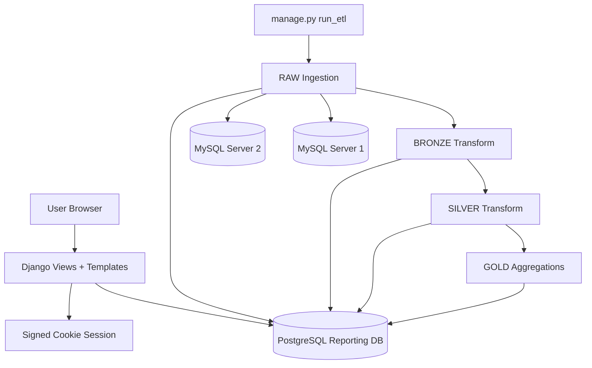
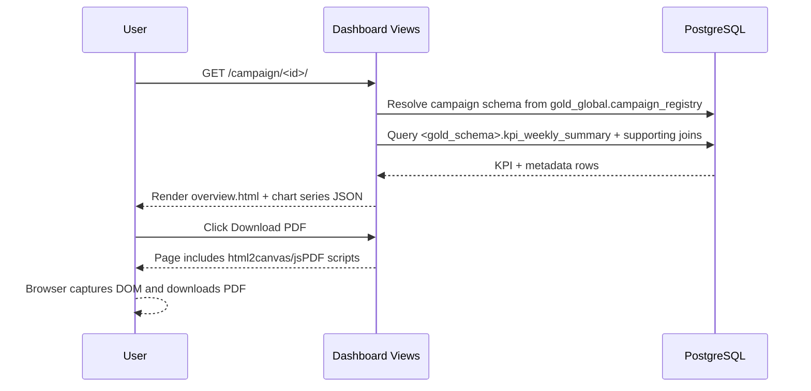
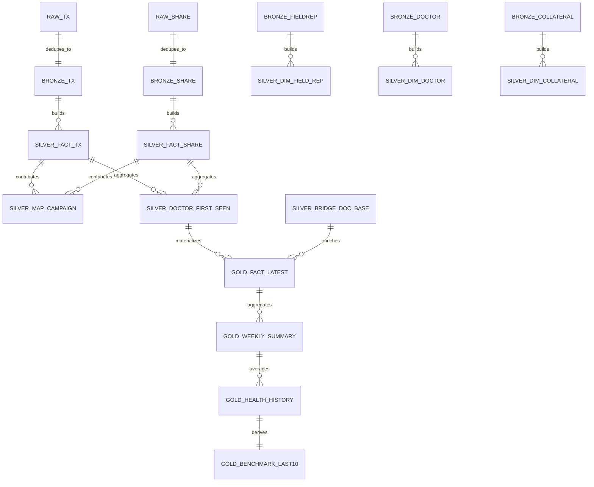

# EXPLANATION.md

## 1. Product Overview

### What this system does
This repository implements a Django-based reporting system for campaign analytics with an ETL pipeline that materializes data into a medallion architecture: **RAW → BRONZE → SILVER → GOLD**. The resulting GOLD tables are used by a server-rendered dashboard for campaign-level KPI reporting and diagnostics.

### Problem it solves
The system consolidates campaign, collateral, doctor, and interaction events from two MySQL sources into PostgreSQL analytical schemas, so business users can:
- inspect campaign performance,
- compare current vs best/benchmark outcomes,
- view weekly health trends,
- and troubleshoot ETL/data readiness via debug pages.

### Core features implemented
- End-to-end ETL orchestration via `python manage.py run_etl`.
- Source extraction from two MySQL servers.
- Layered transformation into RAW/BRONZE/SILVER/GOLD PostgreSQL schemas.
- Campaign menu, campaign login gate, campaign overview dashboard, and ETL debug UI.
- PDF export of dashboard using browser-side rendering libraries.
- Lightweight signed-cookie session auth for campaign access.

### Target users / personas
- **Data/Reporting engineers**: run ETL, inspect control logs, debug table readiness.
- **Ops/Deployment engineers**: configure env, bootstrap local/EC2 deployments.
- **Business/report consumers**: open campaign dashboard and review weekly/campaign KPIs.

### Typical user journey
1. Engineer configures `.env` and runs ETL.
2. User opens `/` menu and chooses a campaign.
3. User logs in with deterministic campaign credentials shown in login hint.
4. User views overview dashboard, filters by week, and optionally exports PDF.
5. Engineer can inspect `/debug/etl/` for schema/table existence and latest ETL notes.

---

## 2. System Architecture

### High-level architecture
- **Presentation layer**: Django templates + static CSS/JS (`dashboard/templates`, `dashboard/static`).
- **Web/controller layer**: Django view functions (`dashboard/views.py`).
- **Service/data processing layer**: ETL pipeline modules (`etl/pipelines/*`).
- **Data access layer**:
  - PostgreSQL execution helpers (`etl/connectors/postgres.py`),
  - MySQL connectors (`etl/connectors/mysql_server1.py`, `mysql_server2.py`).
- **Storage**:
  - PostgreSQL analytical schemas and control logs,
  - MySQL operational source systems.

### Architecture diagram


### Component interaction diagram


---

## 3. Repository Structure

### Tree overview
```text
.
├── config/
│   ├── settings/
│   │   ├── base.py
│   │   ├── dev.py
│   │   └── prod.py
│   ├── urls.py
│   ├── asgi.py
│   └── wsgi.py
├── dashboard/
│   ├── static/dashboard/css/overview.css
│   ├── static/dashboard/js/overview.js
│   ├── templates/dashboard/
│   │   ├── menu.html
│   │   ├── login.html
│   │   ├── overview.html
│   │   └── debug.html
│   └── views.py
├── etl/
│   ├── connectors/
│   │   ├── postgres.py
│   │   ├── mysql_server1.py
│   │   └── mysql_server2.py
│   ├── control/repository.py
│   ├── management/commands/run_etl.py
│   ├── pipelines/
│   │   ├── raw_ingestion.py
│   │   ├── bronze_transform.py
│   │   ├── silver_transform.py
│   │   └── gold_aggregations.py
│   └── utils/
│       ├── normalization.py
│       └── specs.py
├── docs/TECHNICAL_DOCUMENTATION.md
├── setup_local.sh
├── requirements.txt
├── manage.py
├── .env
├── README.md
└── sample CSV/PDF reference files
```

### Directory purposes
- `config/`: Django project configuration and environment-aware settings.
- `dashboard/`: Web UI views/templates/static assets.
- `etl/`: Data extraction/transformation/loading and orchestration.
- `docs/`: Existing architecture narrative docs.
- root scripts/files:
  - `manage.py`: command entrypoint.
  - `setup_local.sh`: bootstrap helper.
  - `.env`: environment variable file for local/dev defaults.
  - CSV files: source-like sample data artifacts (not primary ETL runtime input per README).

---

## 4. Core System Components

### A) Dashboard (Web layer)
**File:** `dashboard/views.py`

Responsibilities:
- Campaign listing (`menu_page`) from `gold_global.campaign_registry` with filtering of null/test/dummy-like names.
- Campaign login (`campaign_login`) with deterministic credentials derived from campaign id.
- Overview rendering (`campaign_overview`) using `_build_report_context`.
- ETL debug rendering (`etl_debug_page`) showing schema/table diagnostics.
- Report export route (`export_report`) reusing overview context.

Key internals:
- `_fetch_dicts`: executes SQL and returns list of dict rows.
- `_build_media_logo_url`: converts `company_logo` path to full media URL prefix.
- `_row_has_week_data`: excludes empty metric weeks.
- `_health_color`: score color mapping.

Dependencies:
- Django DB connection,
- GOLD/SILVER/BRONZE PostgreSQL schemas,
- `SOURCE_TABLE_SPECS` for debug layer table list.

### B) ETL orchestration command
**File:** `etl/management/commands/run_etl.py`

Responsibilities:
- create control tables,
- run ingestion and all transforms in sequence,
- compute success/partial/fail based on source table extraction errors,
- persist JSON notes into control log.

Pipeline order:
1. `ingest_raw(run_id)`
2. `build_bronze()`
3. `build_silver(run_id)`
4. `build_gold(run_id)`

### C) Connectors
- `etl/connectors/postgres.py`: generic execute/fetchall wrappers over Django DB cursor.
- `etl/connectors/mysql_server1.py`, `mysql_server2.py`: full-table extraction with timeout/SSL options and detailed error hints.

### D) Pipeline modules
- `raw_ingestion.py`: creates `raw_server1`/`raw_server2` tables from canonical specs and inserts source rows plus audit metadata.
- `bronze_transform.py`: deduplicates raw rows into `bronze` schema and applies exclusion rule for test/blank campaign IDs in transactions.
- `silver_transform.py`: builds normalized dimensions/facts and identity mappings via `CREATE TABLE AS SELECT`.
- `gold_aggregations.py`: generates per-campaign GOLD schemas + global campaign health/benchmark tables.

### E) Control repository
**File:** `etl/control/repository.py`

Creates/maintains:
- `control.etl_run_log`
- `control.etl_step_log`
- `control.etl_watermark`
- `control.dq_issue_log`

And `log_run` upserts run status/notes.

### F) Static Frontend behavior
- `overview.js`: canvas-based grouped bar chart (4 series), week selector auto-submit, PDF export via `html2canvas` + `jsPDF`.
- `overview.css`: dashboard layout, cards, legend swatches, responsive breakpoints.

---

## 5. Data Model / Database Design

> Note: No Django ORM models or migration files define these schemas. The schema is created dynamically with SQL in ETL pipeline modules.

### Layered schemas
- RAW: `raw_server1`, `raw_server2`
- BRONZE: `bronze`
- SILVER: `silver`
- GOLD: `gold_global` and per-campaign `gold_campaign_*`
- CONTROL: `control`
- OPS: `ops`

### Source specifications (logical raw tables)
From `etl/utils/specs.py`, source extraction targets:
- `mysql_server_1`: `campaign_campaignfieldrep`, `campaign_campaign`
- `mysql_server_2`: `campaign_management_campaign`, `collateral_management_campaigncollateral`, `collateral_management_collateral`, `sharing_management_sharelog`, `sharing_management_collateraltransaction`, `doctor_viewer_doctor`

All raw/bronze tables are text-typed and include audit columns:
`_ingestion_run_id, _ingested_at, _source_server, _source_table, _extract_started_at, _extract_ended_at, _record_hash, _is_deleted, _dq_status, _dq_errors`.

### SILVER entities (created via CTAS)
- `silver.dim_field_rep`
- `silver.dim_doctor`
- `silver.dim_collateral`
- `silver.bridge_campaign_collateral_schedule`
- `silver.fact_collateral_transaction`
- `silver.fact_share_log`
- `silver.map_brand_campaign_to_campaign`
- `silver.bridge_brand_campaign_doctor_base`
- `silver.doctor_action_first_seen`

### GOLD entities
For each campaign (schema name computed from campaign id):
- `<gold_campaign_x>.fact_doctor_collateral_latest`
- `<gold_campaign_x>.kpi_weekly_summary`
- `<gold_campaign_x>.weekly_action_items` (empty scaffold table with same structure as weekly summary)

Global:
- `gold_global.campaign_registry`
- `gold_global.campaign_health_history`
- `gold_global.benchmark_last_10_campaigns`

### CONTROL + OPS entities
- `control.etl_run_log`, `control.etl_step_log`, `control.etl_watermark`, `control.dq_issue_log`
- `ops.exclusion_rules`

### Relationship summary


### Not explicitly defined
- Physical DB indexes beyond primary keys in control/global tables are **not explicitly defined**.
- Foreign keys are **not explicitly defined**; relationships are implied by joins and naming.

---

## 6. Feature-Level Documentation

### Feature 1: Campaign menu and campaign filtering
- **Purpose**: Show available campaign reports.
- **Flow**: query registry + joins to derive campaign name; exclude null/test/dummy-like records.
- **Data sources**: `gold_global.campaign_registry`, `silver.map_brand_campaign_to_campaign`, `bronze.campaign_campaign`, `bronze.campaign_management_campaign`.

### Feature 2: Campaign login gate
- **Purpose**: lightweight campaign-scoped access control.
- **Mechanism**: deterministic credentials generated from campaign id (`brand_<first6>`, `report_<last4>`), stored in signed cookie session key `auth_<campaign_id>`.
- **Note**: This is not integrated with Django auth users.

### Feature 3: Campaign overview KPIs
- **Purpose**: display campaign and weekly health, KPI tiles, state attention, trend chart, and collateral comparisons.
- **Data sources**:
  - campaign schema from `gold_global.campaign_registry`,
  - weekly metrics from `<gold_schema>.kpi_weekly_summary`,
  - metadata from `bronze`/`silver` joins.
- **Business logic present in code**:
  - consumed doctors as unique OR of video>50/pdf in GOLD weekly aggregation,
  - reached percentage capped using `LEAST(...,1.0)` in weekly health,
  - color thresholds red<40, yellow<60, green otherwise.

### Feature 4: Company logo rendering
- **Purpose**: show campaign-specific company logo when available.
- **Logic**: fetch `company_logo` path from `bronze.campaign_management_campaign`, convert to full URL using fixed prefix `https://inclinic.inditech.co.in/media/`.
- **Fallback**: if missing, render textual brand logo block.

### Feature 5: ETL debug page
- **Purpose**: inspect schema and table availability/row counts, latest ETL status, and campaign schema table readiness.
- **Data sources**: `information_schema`, control log table, and expected table lists from `SOURCE_TABLE_SPECS`.

### Feature 6: PDF export
- **Purpose**: client-side export of current dashboard view.
- **Implementation**: `html2canvas` captures `#report-root`; `jsPDF` writes one or multiple A4 pages.

---

## 7. API / Service Layer

This is primarily a server-rendered Django app (not JSON REST). The relevant HTTP endpoints are page routes:

| Endpoint | Method | Purpose | Request Parameters | Request Body | Response | Auth | Database |
|---|---|---|---|---|---|---|---|
| `/` | GET | Campaign menu | None | None | HTML menu page | No | `gold_global` + `silver/bronze` joins |
| `/debug/etl/` | GET | ETL diagnostics snapshot | None | None | HTML debug page | No | `information_schema`, `control.etl_run_log`, multiple layer tables |
| `/campaign/<brand_campaign_id>/login/` | GET, POST | Campaign login gate | Path: `brand_campaign_id` | `username`, `password` (form) | HTML login / redirect | Session flag set on valid credentials | campaign list lookup from DB |
| `/campaign/<brand_campaign_id>/` | GET | Campaign overview | Path + optional `?week=<int>` | None | HTML overview page | Requires `auth_<campaign_id>` session | campaign GOLD schema + supporting bronze/silver tables |
| `/campaign/<brand_campaign_id>/export/` | GET | Export-friendly overview render | Path + optional `?week=<int>` | None | HTML overview page (`export_mode` context flag) | Requires `auth_<campaign_id>` session | Same as overview |
| `/admin/` | GET/POST | Django admin endpoint | Standard Django | Standard Django | Django admin | Standard Django auth | Not customized in repo |

### Command/service interfaces
- `python manage.py run_etl [--run-id <id>]`: executes ETL orchestration service pipeline.
- Internally writes run outcomes to `control.etl_run_log`.

---

## 8. End-to-End Application Flow

### Flow A: ETL run
```text
Operator runs `python manage.py run_etl`
↓
ensure_control_tables()
↓
ingest_raw(run_id) from MySQL1/MySQL2 into raw_server1/raw_server2
↓
build_bronze() dedupe/filter into bronze
↓
build_silver(run_id) derive dimensions/facts/mappings
↓
build_gold(run_id) build per-campaign and global tables
↓
log_run(status + counts + errors JSON)
```

### Flow B: Campaign dashboard access
```text
User opens `/`
↓
Menu page lists campaigns from gold_global registry
↓
User navigates to /campaign/<id>/login/
↓
POST credentials validated against deterministic pattern
↓
Session key auth_<id> set
↓
Redirect /campaign/<id>/
↓
View resolves campaign schema + KPI context
↓
Template renders KPI cards, trend chart, weekly table, state panel
```

### Flow C: Week filtering
```text
User selects week in dropdown
↓
GET /campaign/<id>/?week=<n>
↓
View validates selected week against available weeks with non-zero data
↓
Context narrowed to selected week rows
↓
UI updates KPI cards/table/chart series
```

### Flow D: Debug diagnostics
```text
User opens /debug/etl/
↓
View checks expected schemas/tables and row counts
↓
Reads latest run notes from control.etl_run_log
↓
Renders diagnostic tables and error list
```

---

## 9. Developer Onboarding Guide

### Environment setup
Required runtime/tools visible in repository:
- Python 3.x
- Django 5.x
- PostgreSQL (or Dockerized PostgreSQL)
- Access to source MySQL databases (for real extraction)
- Optional Docker CLI (used by setup script)

Dependencies (`requirements.txt`):
- `Django>=5.0,<6.0`
- `psycopg2-binary>=2.9`
- `PyMySQL>=1.1`
- `cryptography>=42.0`

### Installation
```bash
python -m venv .venv
source .venv/bin/activate
pip install -r requirements.txt
```

Populate `.env` with:
- Django settings key/debug,
- PostgreSQL connection (`POSTGRES_*`),
- MySQL source connections (`MYSQL_SERVER1_*`, `MYSQL_SERVER2_*`).

### Running application
```bash
python manage.py check
python manage.py run_etl
python manage.py runserver
```

### Bootstrap script
`./setup_local.sh` automates:
1. `.env` existence check,
2. virtualenv creation + dependency install,
3. optional `reports-postgres` Docker startup/creation,
4. `python manage.py check`,
5. `python manage.py run_etl`.

### Settings behavior
Dotenv load precedence in `config/settings/base.py`:
1. `DJANGO_ENV_FILE`
2. `/var/www/secrets/.env`
3. repo `.env`

Database env alias support includes `POSTGRES_*`, plus generic `DB_*` and `PG*` names.

### Production notes (from repo)
- `config/settings/prod.py` sets `DEBUG=False`.
- README documents deployment env practices and ETL-on-deploy behavior.

### Testing status
- There is no dedicated automated unit/integration test suite in this repository.
- Validation is command-based (`manage.py check`, ETL run).

---

## 10. AI-Optimized System Summary

- **Stack**: Django server-rendered app + SQL-heavy ETL.
- **Primary apps**:
  - `dashboard`: all HTTP views/UI templates,
  - `etl`: extraction + transformations + control logging.
- **Data pipeline**:
  - MySQL full-table pulls → text-typed RAW tables with audit metadata,
  - BRONZE dedupe/filter,
  - SILVER normalized facts/dims/mappings,
  - GOLD per-campaign KPI mart + global health benchmark.
- **Critical tables**:
  - campaign registry: `gold_global.campaign_registry`,
  - per-campaign KPI: `<gold_campaign_*>.kpi_weekly_summary`,
  - latest doctor/collateral grain: `<gold_campaign_*>.fact_doctor_collateral_latest`,
  - run logs: `control.etl_run_log`.
- **Dashboard dependency chain**:
  - menu needs campaign registry,
  - overview requires campaign-specific GOLD schema and supporting bronze/silver enrichment.
- **Auth model**: deterministic campaign credentials + signed-cookie session key; no full user management.
- **Extension points**:
  - add new source tables by editing `SOURCE_TABLE_SPECS` and downstream SQL transforms,
  - add KPIs by extending GOLD CTAS queries and dashboard context/template,
  - improve security by replacing deterministic credential pattern with Django auth/SSO,
  - add tests around ETL SQL output and view context integrity.
- **Known constraints from codebase**:
  - SQL-centric transformations are not versioned by migrations,
  - table structures are recreated in pipeline runs (DROP/CTAS pattern in SILVER/GOLD),
  - schema contracts are implicit in SQL, not enforced via ORM models.

